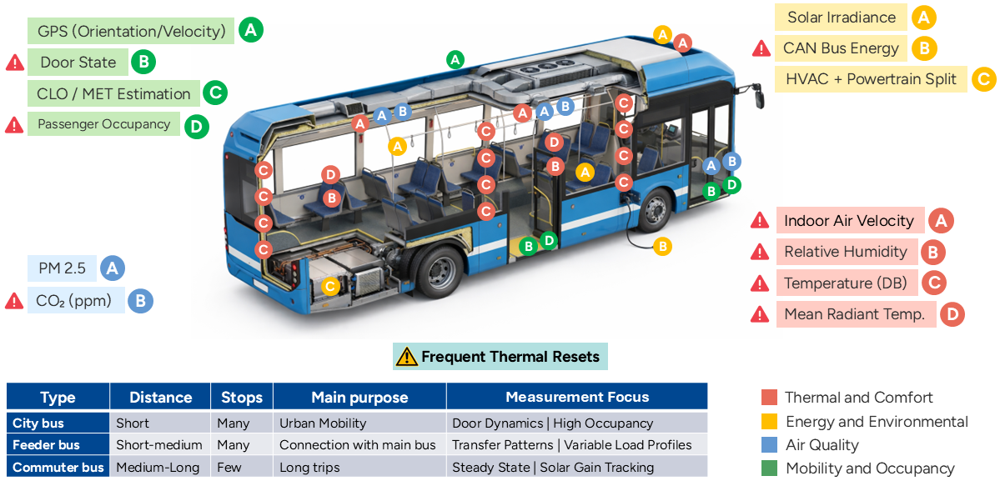
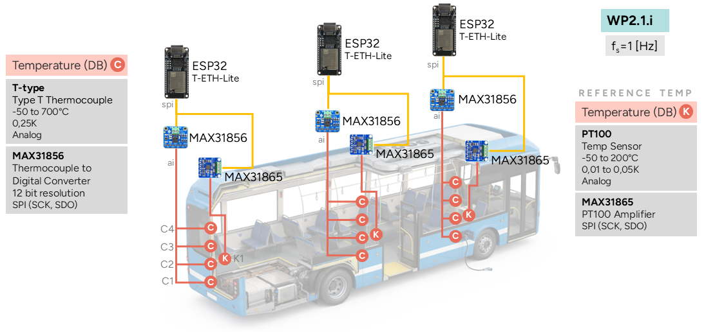
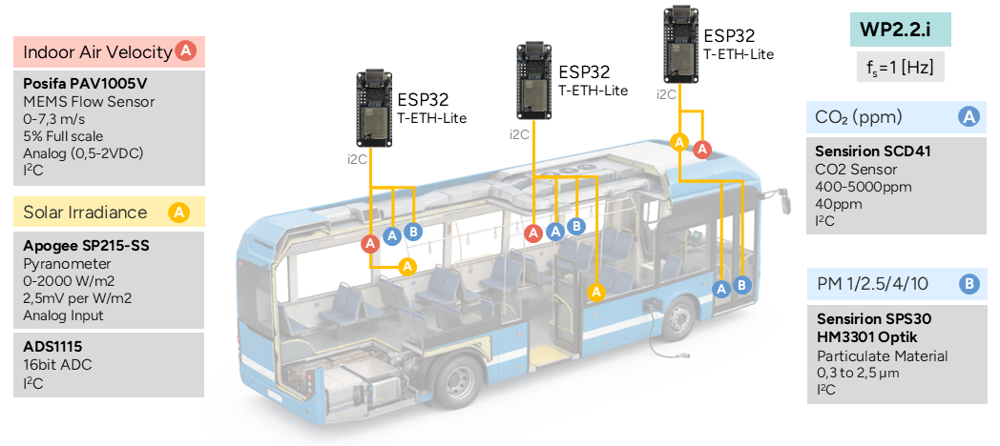
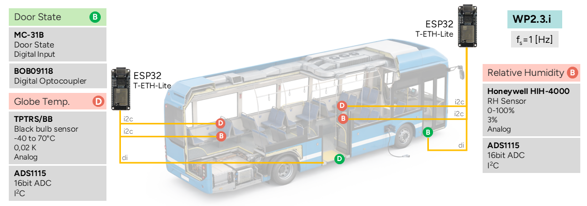
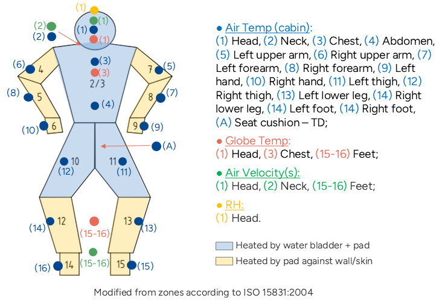
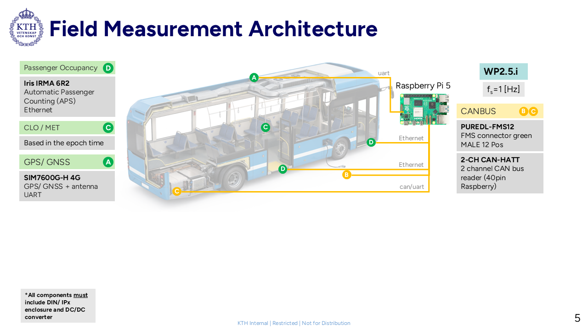
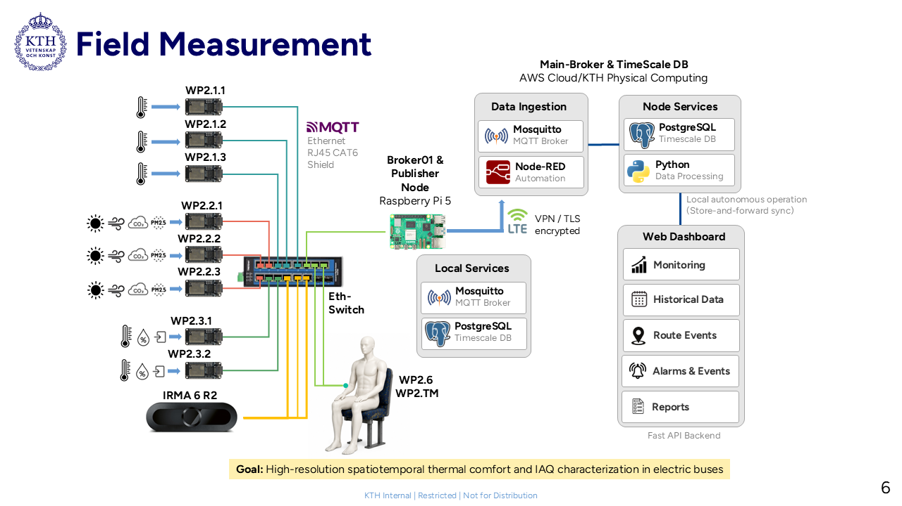
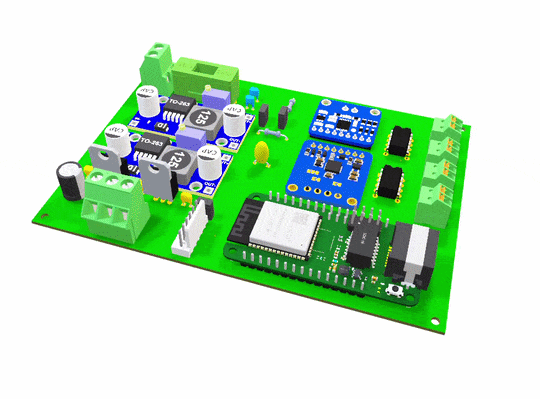
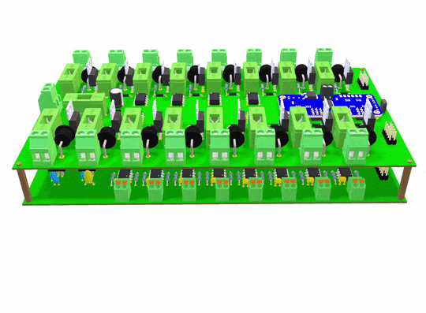

# ElBussTransTherm
*ElBussTransTherm* is a Swedish research project funded by the Swedish Energy Agency (Energimyndigheten) in colaboration with KTH and Nobina that investigates how the energy used for heating, ventilation, and air conditioning (HVAC) in electric buses interacts with battery performance and passenger comfort.

## Main Objective
The project investigates the relationship between passenger thermal comfort, drivetrain and battery thermal management, and energy consumption for heating/cooling in electric city buses. The goal is to minimize energy  consumption for electric buses in public transport through optimization of climate strategies and operational  strategies. Through field studies, simulations, passenger surveys, and pilot studies, guidelines for operators and manufacturers are developed. Specifically, the project can, together with the Traffic Administration and Operators, identify strategies and measures that can enhance the value of conducted Energy Audits. The project is expected to contribute to increased energy efficiency and accelerate the transition to sustainable public transport, in line with the call's aim to promote applicable solutions for the transport system's energy transition.

## Main Research question:
How can thermal management and operational strategies be optimized to reduce total energy consumption in electric city buses while maintaining passenger thermal comfort and preserving battery/drivetrain performance?

# Data and Methods:
## Operator's Fleet:
This includes vehicle speed, cumulated energy consumption, HVAC power drawn, HVAC setpoints and output state, ambient temperature, passenger occupancy (APC-Automatic Passenger Counting), door states and state of charge (SoC).

  

## ElBussTransTherm Sensor Grid:
### WP2.1.i: Stratified Cabin Air Temperature Node
This node measures vertical air temperature stratification inside the bus cabin at three longitudinal positions (front, middle, rear), capturing the classic head/seated/abdomen/ankle gradient relevant to passenger thermal comfort. Each position uses four T-type thermocouples (multiplexed through an ADG704 into a MAX31856 amplifier) to sample head-height (standing and seated), abdomen, and ankle-level air temperature, plus a 3-wire PT100 RTD (via MAX31865) as a stable reference/control channel. An ESP32-S3 (T-ETH-Lite) reads all channels at 1Hz over SPI communication protocol, performing local hardware-fault and out-of-bounds validation independent of network state, and publishes the readings as JSON over MQTT via wired Ethernet to a central Raspberry Pi broker, feeding directly into the project's field-measurement dataset on how cabin thermal gradients relate to HVAC energy demand and passenger comfort in electric city buses.

  

### WP2.2.i: Cabin Air Quality & Micro-Environment Node
This node characterizes the cabin's local air quality and micro-climate at three lateral positions (front, right, left), combining indoor air velocity, CO₂, particulate matter, humidity, and solar gain (irradiance) into a single environmental picture per zone. A PAV1005V hot-wire anemometer captures air velocity along both X and Y axes, an SCD41 provides CO₂ concentration alongside its own temperature/RH reading, an SPS30 reports particulate mass concentration across four size bins (PM1.0–PM10), and an SPS-215-SS pyranometer tracks solar irradiance entering through the windows. An ESP32-S3 (T-ETH-Lite) polls all sensors over I2C at 1Hz, validates each reading via I2C transaction status and CRC checks (SCD41/SPS30) independent of network state, and publishes JSON over MQTT via wired Ethernet to a central Raspberry Pi broker supporting the project's analysis of how ventilation, solar gain, and occupant-generated CO₂ interact with climate control energy use.

  

### WP2.3.i: Relative Humidity, Globe Temperature & Door State Node
This node tracks cabin relative humidity, globe temperature, and door-open/closed status at three longitudinal positions (front, middle, rear), data that's central to computing occupant thermal comfort indices (e.g., PMV/PPD) alongside the temperature and air velocity data gathered elsewhere in WP2. An HIH-4000 analog sensor measures relative humidity and a TP-RS-BB captures globe temperature, both read through an ADS1115 over I2C; door state is sensed digitally via an MC-31B switch isolated through a PC817 optocoupler, since door-opening events cause sharp, localized thermal disturbances tied to boarding/alighting patterns. An ESP32-S3 (T-ETH-Lite) samples all three at 1Hz, applies local out-of-bounds and I2C-fault checks regardless of network connectivity, and publishes JSON over MQTT via wired Ethernet to a central Raspberry Pi broker, linking passenger comfort conditions directly to the bus's door-cycling behavior and stop patterns.

  

### WP2.6: Thermal Dummy Surface Sensing Node
This node instruments the ISO 15831-inspired thermal dummy used to emulate passenger presence and measure the actual thermal environment at the body surface, rather than inferring it from ambient cabin sensors alone. Unlike a fully compliant thermal manikin, this is a simplified surrogate, modeled loosely on the ISO 15831 body-zone framework but not built or validated to its full specification. A 16-channel thermocouple array (multiplexed via an ADG726 into a MAX31856, with an RTD reference through a MAX31865) captures skin adjacent air temperature across head, torso, arms, and legs at ISO-inspired body zones; three TPRS-BB add globe temperature at head, chest, and feet; an HIH-4000 measures humidity at the head; and eight PAV1005V sensors (four X/Y pairs at head, neck, and feet, plus two auxiliary channels) capture localized air velocity. All analog channels read through three ADS1115 ADCs addressed separately over I2C. An ESP32-S3 (T-ETH-Lite) samples the full array at 1Hz, checks both I2C faults and MAX31856/MAX31865 hardware fault registers independent of network state, and publishes the surface dataset as JSON over MQTT via wired Ethernet, providing body-zone resolved thermal comfort data that the dummy's own heater control (WP2.TM) uses as its feedback loop, and that the project uses to approximate passenger-level comfort conditions without the cost and complexity of a fully ISO-compliant manikin.

  

### WP2.TM: Thermal Dummy Heater-Pad Control Node
This node drives the active heating side of the thermal dummy, maintaining its 16 body-zone pads at a target skin temperature of 34°C to emulate passenger metabolic heat output and surface temperature. Each zone's NTC10k thermistor is read through one of four ADS1115 ADCs (addressed separately over I2C) and fed into an independent PID controller, which drives a PCA9685 PWM channel controlling that zone's heater pad via a MOSFET driver stage; a hardware fault-detection layer immediately zeroes PWM output and resets the PID's integral term if any zone's sensor reads outside physical bounds, preventing thermal runaway from a failed or disconnected sensor. An ESP32-S3 (T-ETH-Lite) runs all 16 PID loops at 1Hz, forces every heater off at startup as a safety default, and publishes each zone's temperature and active-heating status as JSON over MQTT via wired Ethernet, supplying the internal (pad-side) half of the thermal dummy dataset that complements WP2.6's surface-sensing measurements, together giving the project both what the dummy is emulating (heat output) and what the cabin environment is actually doing to it (surface conditions).

### WP2.5: Central Aggregation Node (CAN Bus, GPS & MQTT Backbone)
Unlike the ESP32-based sensor nodes, WP2.5 is the project's central hub: a Raspberry Pi 5 fitted with a 2-channel CAN-HAT tapped into the bus's FMS connector, and a SIM7600G-H 4G module providing both cellular uplink and GPS positioning. On the CAN side, it captures vehicle-level operational data — SoC (state-of-Charge), HVAC/powertrain/auxiliary energy split, regenerative braking energy, fuel-heater runtime, and remaining electric range, giving the project the energy-consumption context needed to relate cabin climate strategy to actual drivetrain and battery load. GPS from the SIM7600 supplies location, speed, and route context (feeding trip-type classification: city/feeder/commuter), while the same cellular link is dedicated solely to pushing the aggregated dataset onward, with no need for the sensor-side Ethernet LAN to reach the internet at all. The Raspberry-Pi also runs Mosquitto as the local MQTT broker for every WP2.x ESP32 nodes, and a Python-based aggregator subscribes to all their topics, merges them with the CAN and GPS data into the project's unified JSON schema, and republishes a single coherent per-trip record, making WP2.5 the point where all of WP2's distributed thermal, air-quality, and comfort measurements converge with the vehicle's own operating state.

  

Where the integrated data flow for the platform should be something like:

  

Testing of the 3Ds:

