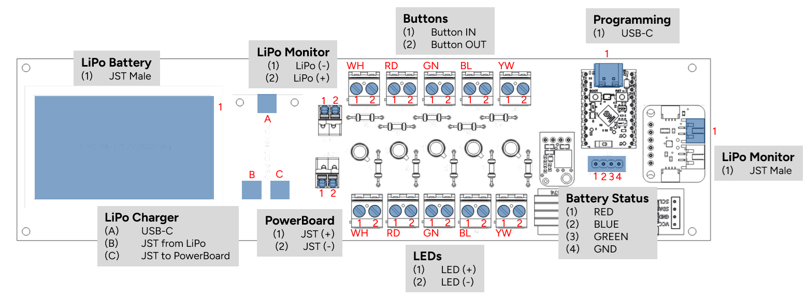
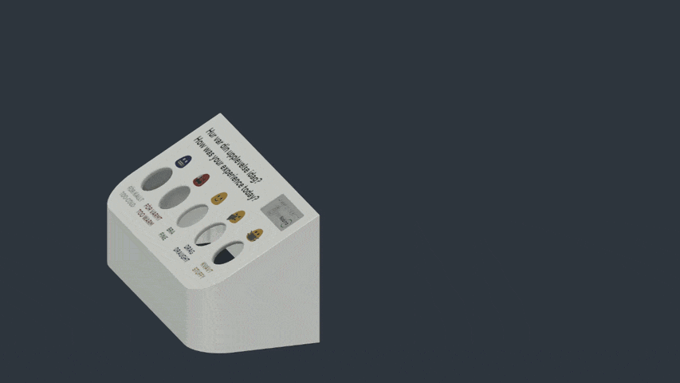

# ElBussTransTherm
*ElBussTransTherm* is a Swedish research project funded by the Swedish Energy Agency (Energimyndigheten) in colaboration with KTH and Nobina that investigates how the energy used for heating, ventilation, and air conditioning (HVAC) in electric buses interacts with battery performance and passenger comfort.

[Return to main](../README.md)

# WP3.ovs

<table>
  <tr>
    <td>
      
    </td>
    <td>
      
    </td>
  </tr>
</table>
